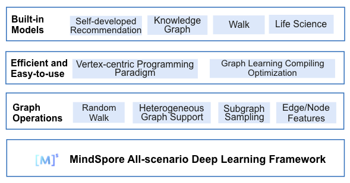

# MindSpore Graph Learning

- [MindSpore Graph Learning Introduction](#mindspore-graph-learning-introduction)
- [Installation](#installation)
    - [System Environment Information Confirmation](#system-environment-information-confirmation)
    - [Installation Methods](#installation-methods)
        - [Installation by pip](#installation-by-pip)
        - [Installation by Source Code](#installation-by-source-code)
    - [Installation Verification](#installation-verification)

## MindSpore Graph Learning Introduction

MindSpore Graph Learning is an efficient and easy-to-use graph learning framework.



Compared to the normal model, a graph neural network model transfers and aggregates information on a given graph
structure, which cannot be intuitively expressed through entire graph computing. MindSpore Graph Learning provides a
point-centric programming paradigm that better complies with the graph learning algorithm logic and Python language
style. It can directly translate formulas into code, reducing the gap between algorithm design and implementation.

Meanwhile, MindSpore Graph Learning combines the features of MindSpore graph kernel fusion and auto kernel generator (
AKG) to automatically identify the specific execution pattern of graph neural network tasks for fusion and kernel-level
optimization, covering the fusion of existing operators and new combined operators in the existing framework. The
performance is improved by 3 to 4 times compared with that of the existing popular frameworks.

Combined with the MindSpore deep learning framework, the framework can basically cover most graph neural network
applications. For more details, please refer to <https://gitee.com/mindspore/graphlearning/tree/master/model_zoo>.

## Installation

### System Environment Information Confirmation

- Ensure that the hardware platform is the Linux system, Windows and Mac are not supported.
- Refer to [MindSpore Installation Guide](https://www.mindspore.cn/install/en) to complete the installation of
  MindSpore, which requires at least version 1.6.1.
- For other dependencies, please refer
  to [requirements.txt](https://gitee.com/mindspore/graphlearning/blob/master/requirements.txt).

### Version dependency

Due the dependency between MindSpore Graph Learning and MindSpore, please follow the table below and install the corresponding MindSpore verision from [MindSpore download page](https://www.mindspore.cn/versions/en).

| MindSpore Graph Learning Version |                              Branch                              | MindSpore Minimum Version Requirements |
|:--------------------------------:|:----------------------------------------------------------------:|:--------------------------------------:|
|              master              | [master](https://gitee.com/mindspore/graphlearning/tree/master/) |                >=1.10.0                |
|              0.2.0a0               |   [r0.2.0-alpha](https://gitee.com/mindspore/graphlearning/tree/r0.2.0-alpha/)   |                >=1.10.0                |

### Installation Methods

You can install MindSpore Graph Learning either by pip or by source code.

#### Installation by pip

- Ascend/CPU

    ```bash
    pip install https://ms-release.obs.cn-north-4.myhuaweicloud.com/2.0.0a0/GraphLearning/cpu/{system_structure}/mindspore_gl-0.2.0a0-cp37-cp37m-linux_{system_structure}.whl --trusted-host ms-release.obs.cn-north-4.myhuaweicloud.com -i https://pypi.tuna.tsinghua.edu.cn/simple
    ```

- GPU

    ```bash
    pip install https://ms-release.obs.cn-north-4.myhuaweicloud.com/2.0.0a0/GraphLearning/gpu/x86_64/cuda-{cuda_verison}/mindspore_gl-0.2.0a0-cp37-cp37m-linux_x86_64.whl --trusted-host ms-release.obs.cn-north-4.myhuaweicloud.com -i https://pypi.tuna.tsinghua.edu.cn/simple
    ```

> - When the network is connected, dependency items are automatically downloaded during .whl package installation. For details about other dependency items, see [requirements.txt](https://gitee.com/mindspore/graphlearning/blob/master/requirements.txt). In other cases, you need to manually install dependency items.
> - `{system_structure}` denotes the Linux system architecture, and the option is `x86_64` and `arrch64`.
> - `{cuda_verison}` denotes the CUDA version, and the option is `10.1`, `11.1` and `11.6`。

#### Installation by Source Code

1. Download source code from Gitee.

    ```bash
    git clone https://gitee.com/mindspore/graphlearning.git
    ```

2. Compile and install in MindSpore Graph Learning directory.

    ```bash
    cd graphlearning
    bash build.sh
    pip install ./output/mindspore_gl*.whl
    ```

### Installation Verification

Successfully installed, if there is no error message such as `No module named 'mindspore_gl'` when execute the following
command:

```bash
python -c 'import mindspore_gl'
```
